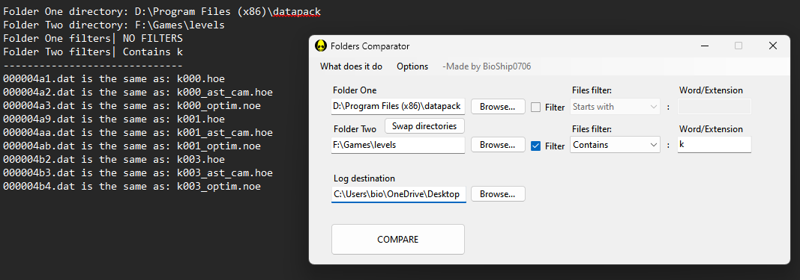

Program that compare all the files of two specified folders, comparison happens between files Hashes for high reliability
---

### How to Use:
- Download from release
- Set the max file size to consider (in Options)
- Set the directories of the folders and where to save the comparison log
- Start comparison, once it finishes, check the log (if there's at least 1 match found)

<h2>🛠️ Tools used:</h2> 
   

